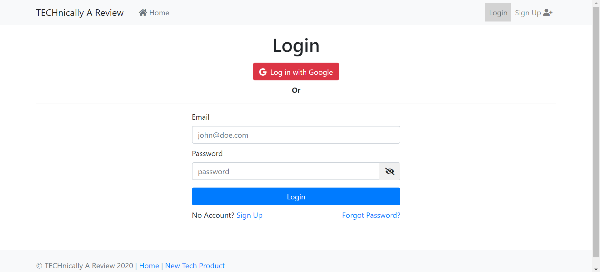
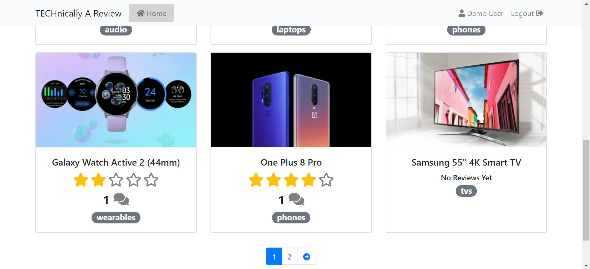
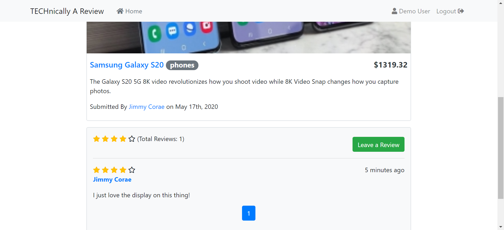
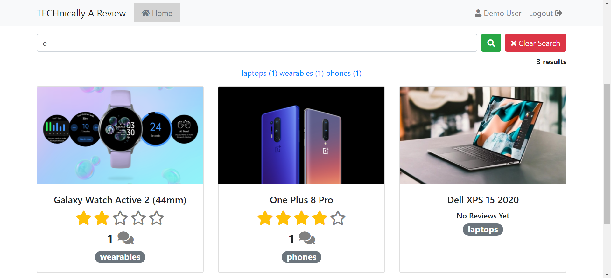
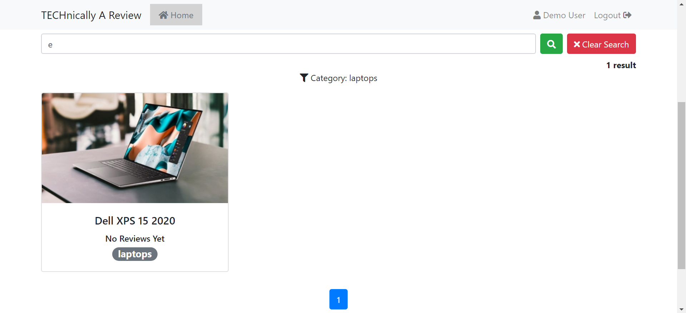
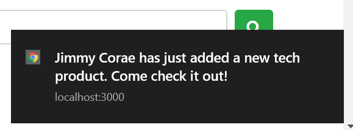
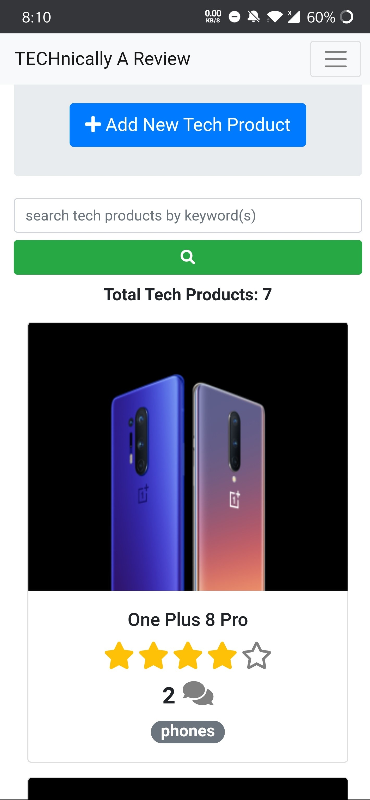

# TECHnically A Review

A RESTful tech product reviewing website with CRUD functionality where users can create their own tech products or review other's tech products.

* [What app looks like](#what-app-looks-like)
* [Features](#features)
* [Dependencies](#dependencies)
* [How to run app locally](#how-to-run-app-locally)

## What app looks like

## Features

- Sign up & login using Google account or by creating a regular account (email & password)
- Create, edit, delete tech products
- Review tech products once, edit or delete review
- See reviews for all tech products
- Search for tech products using the search bar (fuzzy searching) on the home
  - Fuzzy searching searches by finding tech products that match a pattern approximately (rather than exactly).
- After searching, users can narrow their search by selecting from the categories (laptops, tvs...etc) that are show.
  - categories are dynamic (based on the categories of the tech products show after searching).
- Change password (only for non-Google accounts), change profile picture, delete account
- Reset password through the Forgot Password Flow
  - After entering email of forgotten account, users will recieve email with a one-time reset password link that expires in 15 mins
- Recieve real-time notifications anytime someone updates, deletes, creates a review or tech products

## Dependencies

- [Nodejs](https://nodejs.org/en/download/)
  - NPM should be installed after installing Node
- [MongoDB](https://www.mongodb.com/download-center/community)

Main NPM dependencies:

- cloudinary
- cookie-session
- ejs
- express
- mongoose
- multer
- nodemailer
- passport
- passport-google-oauth20
- passport-local
- pusher

## How to run app locally

1. Fork/download manually/clone the repo.
2. Install NPM dependencies using "npm i".
   1. "npm i" will not install dev dependencies. Only dotenv (use "npm i dotenv") is required if you want to use environment variables.
3. Run mongodb server in 1 terminal.
4. Cd into the local project repo.
5. Rename the .env.example file to .env and fill in the correct information.
   1. Create a [Cloudinary account](https://cloudinary.com/users/register/free) to get CLOUDINARY_API_KEY, CLOUDINARY_API_SECRET, CLOUDINARY_CLOUD_NAME.
   2. Create a [Pusher account](https://dashboard.pusher.com/accounts/sign_up) to get PUSHER_APP_CLUSTER, PUSHER_APP_ID, PUSHER_APP_KEY, PUSHER_APP_SECRET.
   3. Go to Google Developer Console to generate a OAuth Client ID. Replace GOOGLE_CLIENT_ID, GOOGLE_CALLBACK_URL, GOOGLE_CLIENT_SECRET accordingly.
6. Enter "node app.js" in the terminal with the project.
7. Go to localhost:3000 on a browser.
